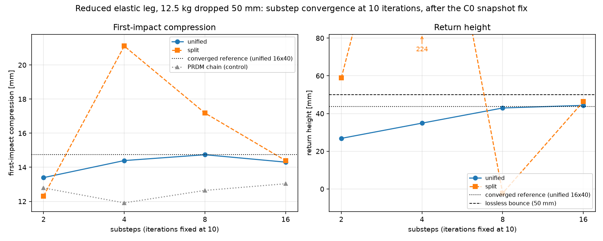
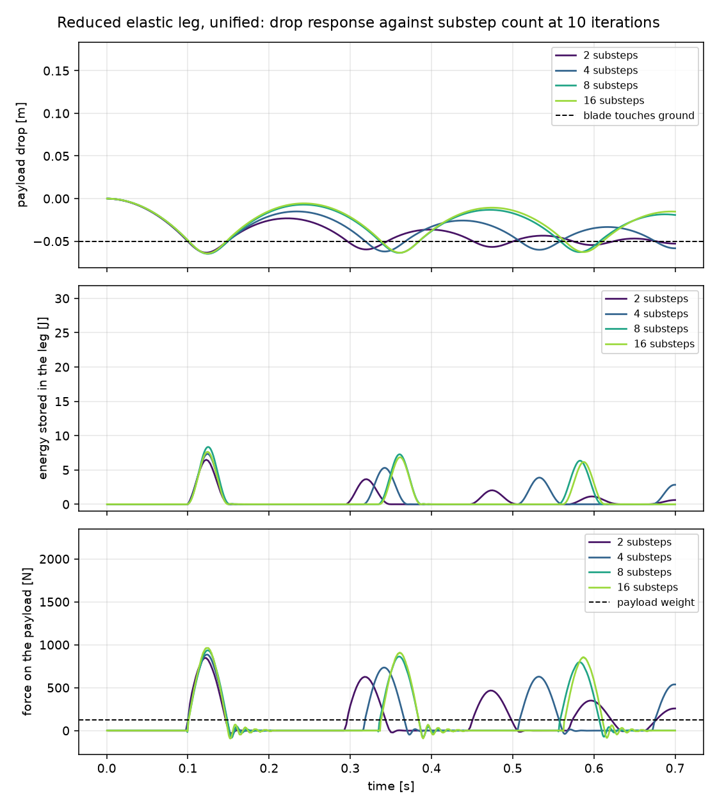
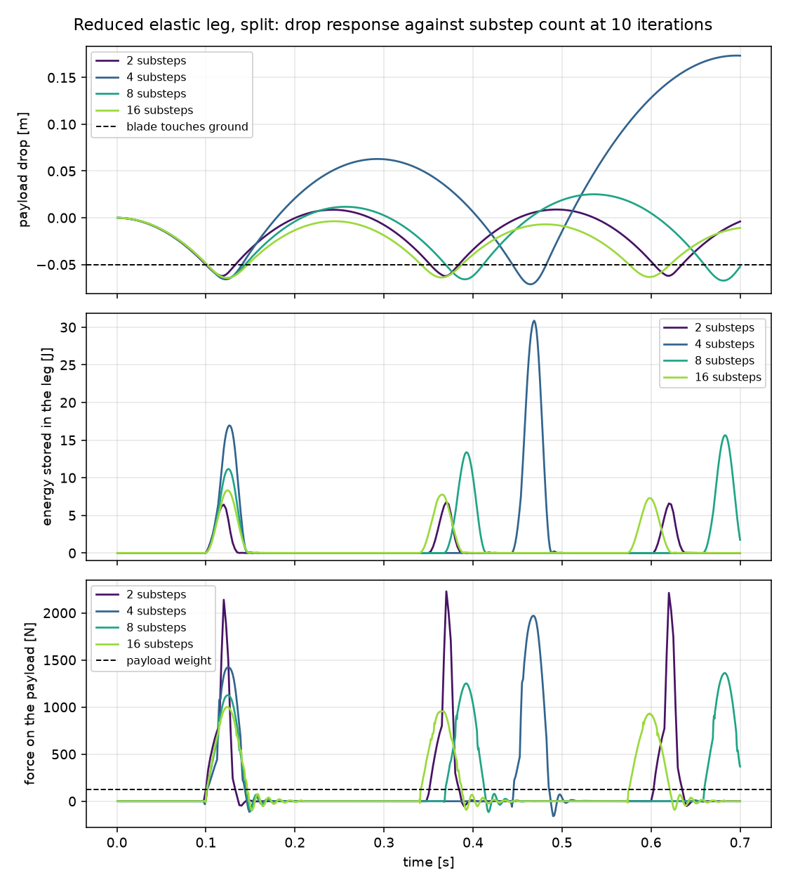
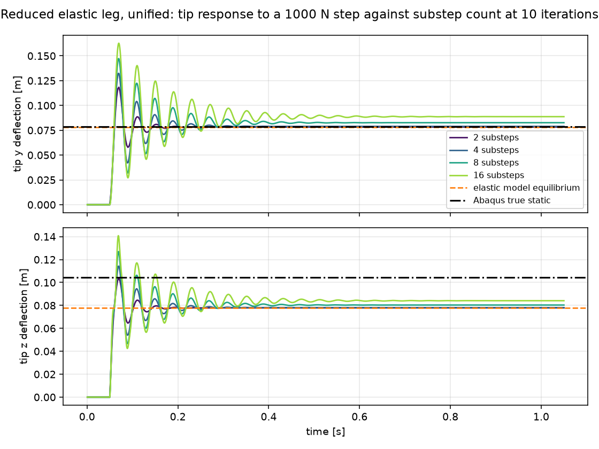
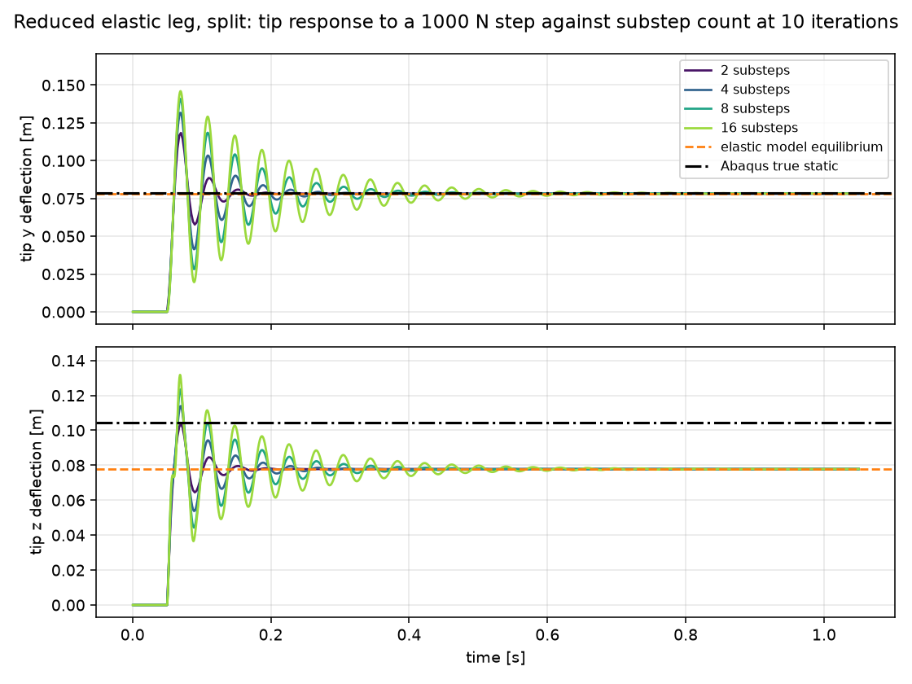

# The C0 snapshot fix: what it changed in the drop test

`drop_elastic_solve.md` measured the reduced elastic leg on a tree where
`step_joint_C0_lambda` returned early for any joint touching an elastic endpoint, leaving the
AVBD stabilization snapshot `C0` at zero while the dual update kept running. That is `alpha = 0`
in the stabilized constraint, which turns the multiplier update into an integrator; the
derivation and its evidence are in `me/math/elastic_dual_runaway.tex`.

This report re-runs that study against the fix. The snapshot is now taken at the previous-step
*deformed* attachment, so `C0` is the same quantity as the constraint the iterations drive to
zero.

Same baseline as before: Young's modulus `9e10`, damping ratio `0.02`, contact `kd = 0.35` on
both legs, articulation relaxation `0.8`, `block_sparse_joints`, `12.5 kg` payload dropped
`5 cm`. Measured on one device, `cuda:0`.

```
python -m me.scripts.shank_parity.drop_elastic_solve
python -m me.scripts.shank_parity.drop_elastic_stability
```

**Summary.**

1. Divergence is gone. Every cell of both grids is finite for both arrangements. Before the fix
   the stability grid diverged in 14 of 30 unified cells and 9 of 30 split cells; it now
   diverges in none.
2. The reversal reported in `drop_elastic_solve.md` section 3 is gone. Refining the step no
   longer requires more iterations, and the `16x20` pocket that was stable-unstable-stable no
   longer exists.
3. Accuracy at converged settings is essentially unmoved: the 40-iteration column reads
   `13.387, 14.048, 14.530, 14.757 mm` against `13.387, 14.048, 14.524, 14.718` before. The
   substep axis is still the accuracy-limiting one and is still not converged at 16.
4. In the drop test the unified arrangement is the better one on every axis measured, not only
   on stability, reversing the previous report's point 4. It never diverges and never gains
   energy, where split still overshoots in five cells. It is far closer to the converged squash
   at low substep and iteration counts and approaches it from below, where split overshoots by
   up to `43%`. Its return height stays inside `[26, 44] mm` across the grid while split ranges
   from `-2` to `224 mm` with no trend. The separation is widest exactly where a training
   preset lives, which makes unified the more usable arrangement here and not merely the safer
   one.
5. That ordering is specific to the drop, and section 4.1 reverses it. On the contact-free step
   load, split reaches the static equilibrium at 10 iterations at every substep count while
   unified settles `8.03%` high at 16 substeps. Both reach the same deflection once iterated
   far enough, so it is an iteration requirement rather than a bias, but which arrangement
   needs more iterations depends on the configuration and cannot be read off the drop alone.

---

## 1. Stability

Maximum `|z|` of the elastic payload over `0.4 s`, in metres. The payload is released from
`0.5867` and only ever falls, so a peak above that value is energy the solver invented. `div`
marks a non-finite run or one that left by more than a metre.

**After the fix.**

unified

| substeps | 2 | 5 | 10 | 20 | 40 |
| ---: | ---: | ---: | ---: | ---: | ---: |
| 4 | 0.5867 | 0.5867 | 0.5867 | 0.5867 | 0.5867 |
| 8 | 0.5867 | 0.5867 | 0.5867 | 0.5867 | 0.5867 |
| 12 | 0.5867 | 0.5867 | 0.5867 | 0.5867 | 0.5867 |
| 16 | 0.5867 | 0.5867 | 0.5867 | 0.5867 | 0.5867 |
| 24 | 0.5867 | 0.5867 | 0.5867 | 0.5867 | 0.5867 |
| 32 | 0.5867 | 0.5867 | 0.5867 | 0.5867 | 0.5867 |

split

| substeps | 2 | 5 | 10 | 20 | 40 |
| ---: | ---: | ---: | ---: | ---: | ---: |
| 4 | 0.5867 | 0.5976 | 0.6496 | 0.5867 | 0.5867 |
| 8 | 0.5921 | 0.5980 | 0.5983 | 0.5867 | 0.5867 |
| 12 | 0.5867 | 0.5876 | 0.5867 | 0.5867 | 0.5867 |
| 16 | 0.5867 | 0.5867 | 0.5867 | 0.5867 | 0.5867 |
| 24 | 0.5867 | 0.5867 | 0.5867 | 0.5867 | 0.5867 |
| 32 | 0.5867 | 0.5867 | 0.5867 | 0.5867 | 0.5867 |

**Before the fix**, as published in `drop_elastic_solve.md` section 3:

unified

| substeps | 2 | 5 | 10 | 20 | 40 |
| ---: | ---: | ---: | ---: | ---: | ---: |
| 4 | 0.5867 | 0.5867 | 0.5867 | 0.5867 | 0.5867 |
| 8 | div | 0.5867 | 0.5867 | 0.5867 | 0.5867 |
| 12 | div | div | 0.5867 | 0.5867 | 0.5867 |
| 16 | div | div | 0.5867 | div | 0.5867 |
| 24 | div | div | div | 0.5867 | 0.5867 |
| 32 | div | div | div | div | div |

split

| substeps | 2 | 5 | 10 | 20 | 40 |
| ---: | ---: | ---: | ---: | ---: | ---: |
| 4 | 0.5867 | 0.5867 | 0.5867 | 0.5867 | 0.5867 |
| 8 | 0.6653 | 0.5867 | 0.5867 | 0.5867 | 0.5867 |
| 12 | div | 0.5867 | 0.5867 | 0.5867 | 0.5867 |
| 16 | div | div | 0.5867 | 0.5867 | 0.5867 |
| 24 | div | div | div | 0.5867 | 0.5867 |
| 32 | div | div | div | 0.5867 | 0.5867 |

**The conventional trade is restored.** The previous report's central anomaly was that the
minimum stable iteration count *rose* with the substep count, so refining the step made things
worse. That was the integrating dual: a finer step lowers `a = k h^2 / M`, and the loop leaves
the unit circle below `a ~ 0.28`. With the snapshot restored there is no lower bound in
iterations at any substep count tested.

**Split improved too, and that is expected.** `step_joint_C0_lambda` is a joint kernel upstream
of how the elastic block is arranged internally, so the fix reaches both arrangements. This also
confirms the scope claim of `elastic_unified_vs_split.md`: the defect was never about the
unified block.

**Unified is now strictly better than split.** It shows no overshoot at all; split still gains
energy in five cells, worst at `4x10` where it reaches `0.6496`, `63 mm` above release. This
reverses point 4 of the previous report, which had unified as the less robust of the two.

## 2. Convergence

First-impact squash in mm. Rows are substeps, columns iterations.

<p align="center"></p>

The figure is the `10`-iteration column of this section and of section 3. Unified approaches
the reference from below and moves smoothly with the step; split overshoots by `43%` at `4`
substeps and swings from `224` to `-2 mm` of return height over one doubling.

**After the fix.**

unified

| substeps | 2 | 5 | 10 | 20 | 40 |
| ---: | ---: | ---: | ---: | ---: | ---: |
| 2 | 14.876 | 13.075 | 13.395 | 13.385 | 13.387 |
| 4 | 11.157 | 12.449 | 14.395 | 14.036 | 14.048 |
| 8 | 10.446 | 12.404 | 14.738 | 14.603 | 14.530 |
| 16 | 10.583 | 12.810 | 14.303 | 14.774 | 14.757 |

split

| substeps | 2 | 5 | 10 | 20 | 40 |
| ---: | ---: | ---: | ---: | ---: | ---: |
| 2 | 1.918 | 3.151 | 12.314 | 13.579 | 13.661 |
| 4 | 2.938 | 6.871 | 21.112 | 13.446 | 14.189 |
| 8 | 6.536 | 11.026 | 17.182 | 14.709 | 14.629 |
| 16 | 8.374 | 11.826 | 14.392 | 14.998 | 14.800 |

**Before the fix.**

unified

| substeps | 2 | 5 | 10 | 20 | 40 |
| ---: | ---: | ---: | ---: | ---: | ---: |
| 2 | 14.673 | 13.137 | 13.397 | 13.385 | 13.387 |
| 4 | 10.993 | 12.764 | 14.358 | 14.038 | 14.048 |
| 8 | diverged | 12.696 | 14.953 | 14.534 | 14.524 |
| 16 | diverged | diverged | 14.470 | 14.830 | 14.718 |

split

| substeps | 2 | 5 | 10 | 20 | 40 |
| ---: | ---: | ---: | ---: | ---: | ---: |
| 2 | 1.631 | 3.464 | 12.379 | 13.471 | 13.564 |
| 4 | 2.732 | 6.252 | 17.049 | 13.413 | 14.128 |
| 8 | 5.589 | 9.981 | 15.281 | 14.749 | 14.505 |
| 16 | diverged | diverged | 14.142 | 16.247 | 14.974 |

Three unified cells and two split cells were previously non-finite or absurd (`8x2` returned
`7.8e31 mm`). All are finite now.

**The converged corner is unmoved.** Reading down the 40-iteration column, unified gives
`13.387, 14.048, 14.530, 14.757` against `13.387, 14.048, 14.524, 14.718` before: differences
of `0.04%` and `0.27%` at 8 and 16 substeps, and none at all at 2 and 4. The fix changes which
configurations *survive*, not where the survivors land. The substep sequence is still monotone
with decrements `0.661, 0.482, 0.227` and is still not converged at 16 substeps.

**Unified is much better behaved.** It is far closer to the converged value at low substep and
iteration counts, taking all ten cells at 2 and 5 iterations, and it approaches the limit from
below: its only two excursions above the reference are `0.81%` and `0.12%`. Split overshoots by
`43%` at `4x10` and `16%` at `8x10`.

**Low iteration counts still carry no accuracy.** The 2- and 5-iteration columns are far from
the reference in both arrangements, and now that they no longer diverge it is worth saying
explicitly that finite is not the same as converged: unified `16x2` returns `10.583 mm`, `28%`
below the reference, while remaining perfectly stable.

## 3. Return height

In mm.

**After the fix.**

unified

| substeps | 2 | 5 | 10 | 20 | 40 |
| ---: | ---: | ---: | ---: | ---: | ---: |
| 2 | 27.82 | 26.35 | 26.84 | 26.77 | 26.75 |
| 4 | 35.08 | 38.58 | 34.91 | 34.88 | 34.74 |
| 8 | 40.70 | 43.91 | 42.94 | 39.76 | 40.46 |
| 16 | 42.91 | 43.93 | 44.33 | 44.13 | 43.67 |

split

| substeps | 2 | 5 | 10 | 20 | 40 |
| ---: | ---: | ---: | ---: | ---: | ---: |
| 2 | 19.34 | 31.53 | 58.84 | 20.14 | 20.53 |
| 4 | 41.31 | 79.68 | 223.86 | 29.76 | 31.67 |
| 8 | 68.36 | 47.36 | -2.22 | 37.34 | 39.12 |
| 16 | 44.58 | 47.05 | 46.35 | 43.84 | 43.47 |

**Before the fix.**

unified

| substeps | 2 | 5 | 10 | 20 | 40 |
| ---: | ---: | ---: | ---: | ---: | ---: |
| 2 | 26.15 | 25.29 | 26.87 | 26.76 | 26.75 |
| 4 | 32.67 | 32.33 | 35.60 | 34.80 | 34.75 |
| 8 | diverged | 38.58 | 40.38 | 40.62 | 40.50 |
| 16 | diverged | diverged | 33.23 | 212760.07 | 43.73 |

split

| substeps | 2 | 5 | 10 | 20 | 40 |
| ---: | ---: | ---: | ---: | ---: | ---: |
| 2 | 13.98 | 14.13 | 38.20 | 23.79 | 24.78 |
| 4 | 30.16 | 26.06 | 39.77 | 33.59 | 33.41 |
| 8 | 325.15 | 30.29 | 40.00 | 33.50 | 40.16 |
| 16 | diverged | diverged | 3.02 | 23.40 | 42.03 |

Unified is now well behaved on this quantity where it previously was not: at 16 substeps it
reads `42.91, 43.93, 44.33, 44.13, 43.67` across the iteration axis, a spread of `3%`, against
a previous row containing `33.23` and `212760`. It is still rising with substeps and still not
converged over the range swept, so no limit is claimed.

Split remains erratic here: `223.86 mm` at `4x10` and `-2.22 mm` at `8x10`. Those are the same
cells that overshoot in section 1, which is consistent with them being one phenomenon rather
than two.

**Unified is predictable and split is not.** Unified stays within `[26.35, 44.33] mm` across the
whole grid and moves smoothly with the discretization. Split spans `[-2.22, 223.86] mm` with no
discernible trend: at `8x10` the payload never recovers above its resting height, and at `4x10`
it rebounds to four and a half times the height it was dropped from.

## 4. Time response

The tables above reduce each run to two scalars. These are the trajectories they come from, at
`10` iterations, one figure per arrangement with the axes shared between them.

<p align="center"></p>

**Unified stays bounded at every step size.** The first impact is nearly step-independent; the
rebound is not, and grows as the step is refined. The payload never returns above the height it
was released from.

<p align="center"></p>

**Split creates energy, and how much depends on the step.** Every substep count but the finest
throws the payload back above its release height, and at worst the leg stores several times the
energy the drop makes available. This is the overshoot of section 1 seen as a trajectory rather
than as a peak.

### 4.1 The same sweep without contact

The step example applies `1000 N` at the tip of a blade clamped to the world and has no ground
contact. Its clamp is a fixed joint onto an elastic endpoint, the joint the C0 snapshot applies
to.

<p align="center"></p>

<p align="center"></p>

Split settles on the model equilibrium at every substep count. Unified settles above it, and the
offset persists to the end of the `1.05 s` run. Percentages below are measured against the model
equilibrium, the dashed line. The distance to the Abaqus line is modelling error common to both
arrangements and is the subject of `shank_parity.md` section 1.

The offset is a convergence limit, not a bias. At 16 substeps:

| iterations | unified | split |
| ---: | ---: | ---: |
| 10 | `+8.03%` | `-0.00%` |
| 40 | `+0.45%` | `+0.02%` |
| 160 | `+0.02%` | `+0.02%` |

Both arrangements reach the same static deflection, `0.07787 m`, given enough iterations.

The offset is a function of `k h^2`, the dimensionless group of `elastic_dual_runaway.tex`.
Varying the clamp stiffness and the step size independently:

| `k h^2` | configurations | unified error |
| ---: | --- | ---: |
| `1.56` | `ke=1e6` at 4 substeps, `ke=1.6e7` at 16 | `0.30%`, `0.26%` |
| `0.39` | `ke=1e6` at 8 substeps, `ke=4e6` at 16 | `3.20%`, `2.81%` |
| `0.098` | `ke=1e6` at 16 substeps, `ke=2.5e5` at 8 | `8.03%`, `8.73%` |

Configurations with equal `k h^2` give equal error, so the substep count enters only through
`h`. Coarsening the step and stiffening the clamp are equally effective; refining the step
reduces accuracy. The configuration used in this report has `k h^2 = 0.098`.

The two arrangements partition the system differently, and the coupling each one cuts is left to
the outer iteration. Unified solves frame and modal coordinates in one block and cuts at the
clamp joint. Split solves the frame in the articulation, where the clamp is resolved directly,
and cuts between frame and modes. The step load acts through the clamp; the drop's contact acts
on a surface the modes displace and so couples frame to modes. Each test therefore loads the
coupling that one arrangement leaves to the iteration.

The ordering here does not contradict section 4: which arrangement requires more iterations
follows from which coupling the configuration loads.

## 5. Control

Maximum absolute difference in PRDM squash between the two arrangements, over all 20
configurations: `0.000e+00`. The rigid chain is still untouched by the elastic arrangement, so
the comparison above is not confounded.

## 6. Limits

The stability-sweep script of the original study was not in the repository and could not be
recovered, so `drop_elastic_stability.py` is a reconstruction from the published description.
It reproduces the release height `0.5867` and the pre-fix table's structure, but the two were
not executed from the same source, and the "before" column of section 1 is quoted from the
published table rather than re-measured.

The divergence criterion is also a reconstruction. The original marked split `8x2` as the value
`0.6653` rather than as divergence, so its threshold was well above one centimetre; the
threshold here is one metre, with overshoot reported as a number. A stricter cut would classify
five split cells as failures rather than as energy gain.

Everything was measured on `cuda:0` only.

## Files

| path | what |
| --- | --- |
| `me/scripts/shank_parity/drop_elastic_solve.py` | discretization grid and convergence |
| `me/scripts/shank_parity/drop_elastic_solve_figures.py` | the section 2 figure, from the cached sweeps |
| `me/scripts/shank_parity/elastic_time_response.py` | the section 4 figures, re-run against the cached scalars |
| `me/scripts/shank_parity/drop_elastic_stability.py` | the stability sweep of section 1 |
| `me/data/shank_parity/drop_elastic_solve_c0.json` | measurements with the fix |
| `me/data/shank_parity/drop_elastic_solve.json` | measurements before the fix, unchanged from `drop_elastic_solve.md` |
| `me/data/shank_parity/drop_elastic_stability.json` | stability sweep with the fix |
| `me/math/elastic_dual_runaway.tex` | why the snapshot mattered |
| `me/reports/drop_elastic_solve.md` | the study this re-runs |
