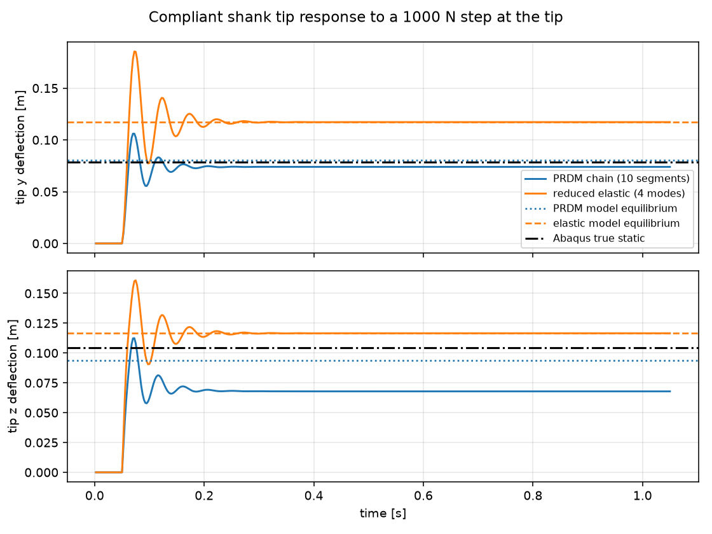
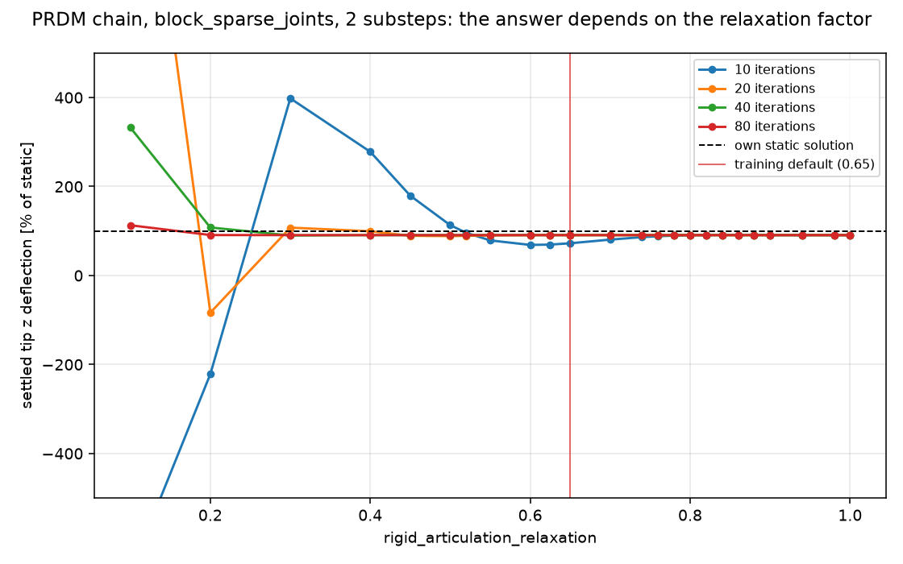
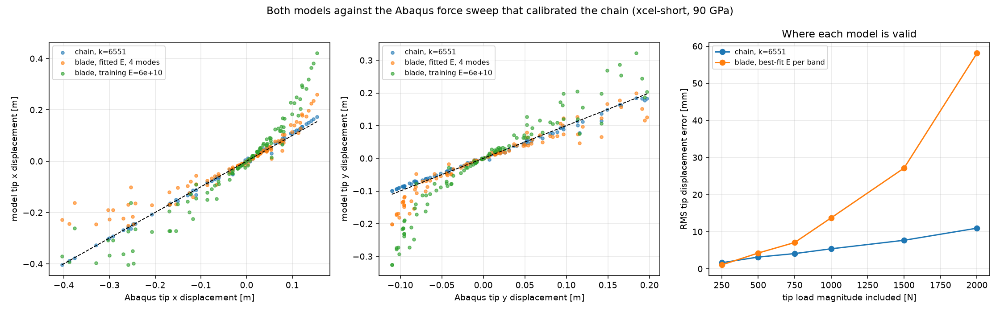
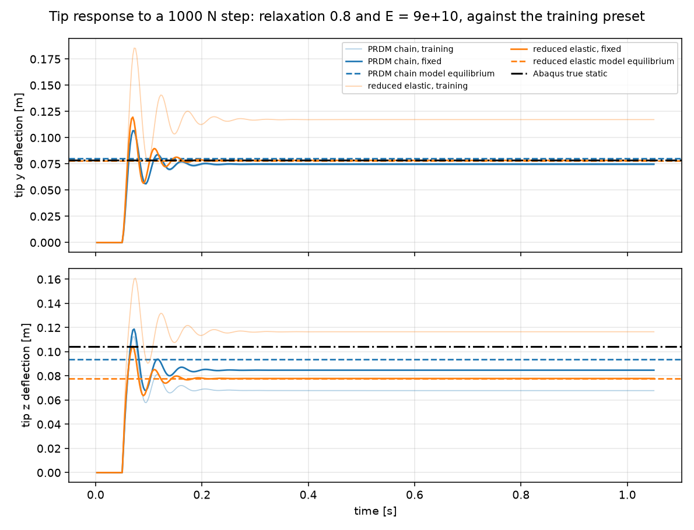
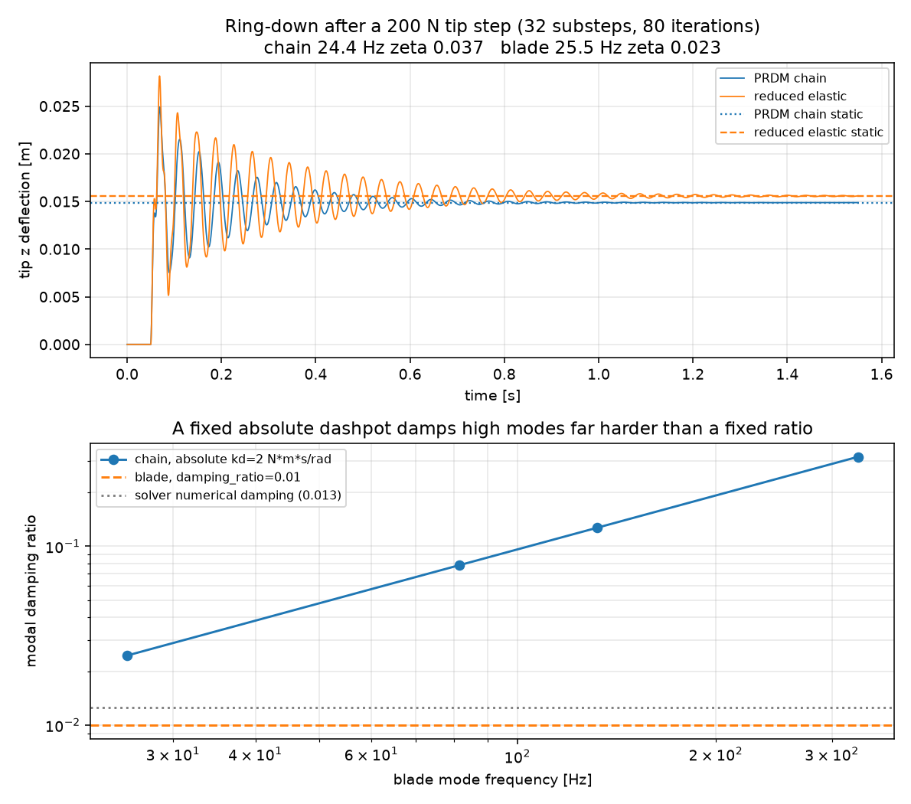
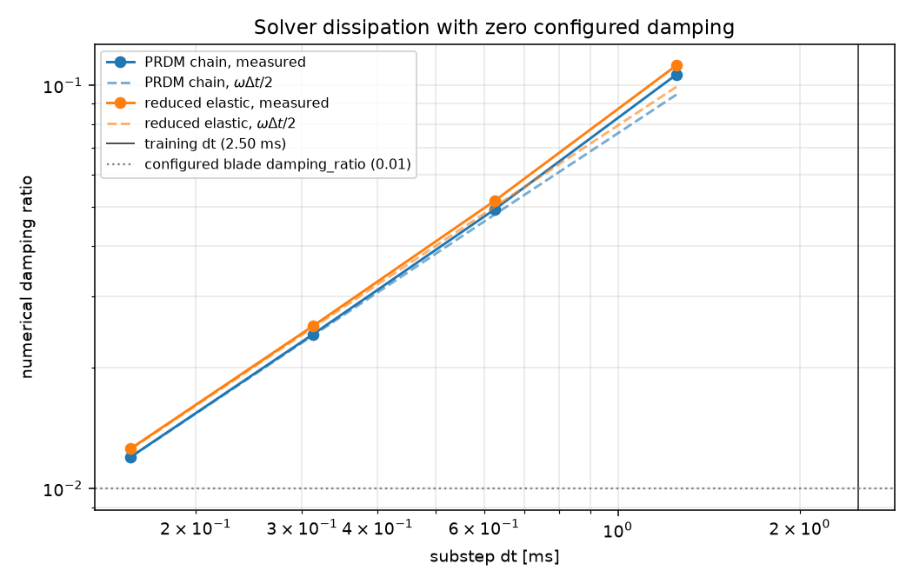
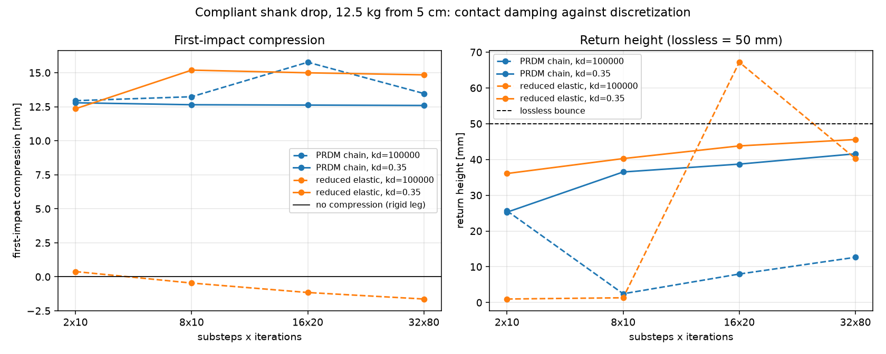
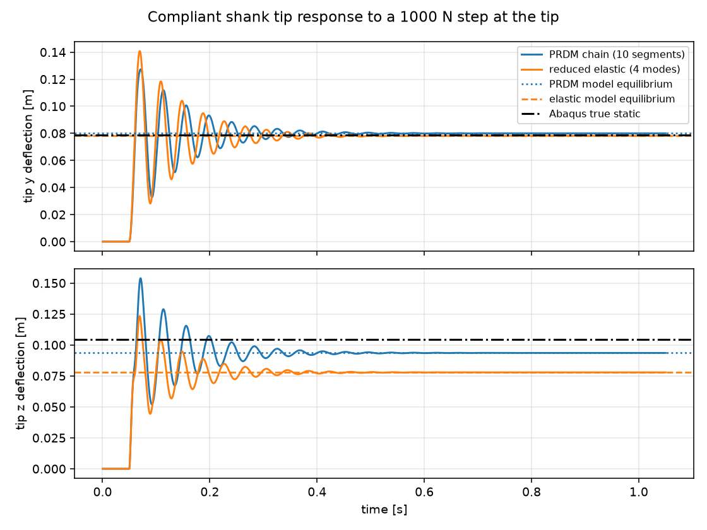
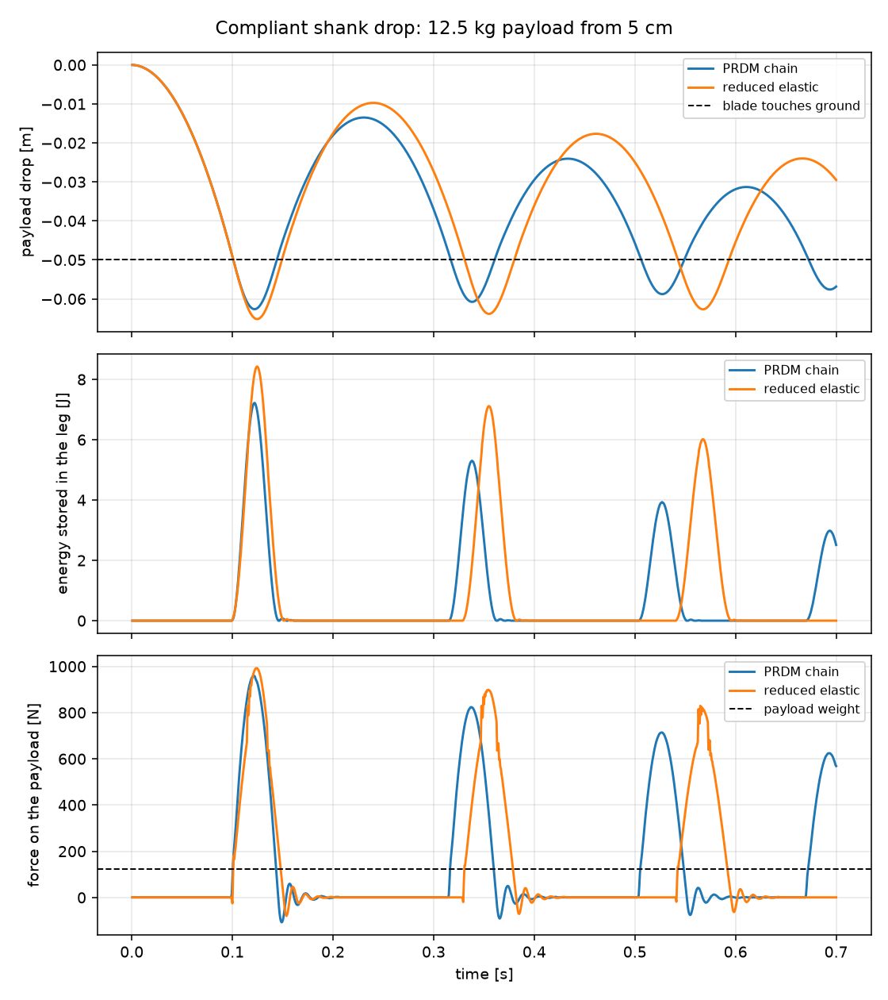

# PRDM spring chain vs reduced elastic blade: do the two ANYmal-D shank models behave the same?

Both compliant-shank models the compliance repo trains with are built here from the same
traced `xcel_short` centerline and driven side by side under identical loads, using the
compliance repo's own training constants on the `reduced-elastic-sparse-tests` branch.

Two examples were added:

| example | load path |
| --- | --- |
| `newton/examples/robot/example_robot_compliant_shank_step.py` | root clamped to the world, gravity off, 1000 N step at the blade tip |
| `newton/examples/robot/example_robot_compliant_shank_drop.py` | 12.5 kg payload on a vertical prismatic slider, dropped 5 cm onto the ground |

```
uv run -m newton.examples robot_compliant_shank_step
uv run -m newton.examples robot_compliant_shank_drop
```

Each writes a PNG and prints a summary table. The step example is the one used throughout
sections 1-4. At the training preset:

<p align="center"></p>

The dashed lines are each model's own static equilibrium, solved in closed form, so the gap to
them is solver error with modelling error factored out. The black line is measured: the tip
displacement of a 3-D solid Abaqus model of the same blade under the same 1000 N tip load
(xcel-short at 90 GPa, base encastre), `disp_z = 0.1044 m`.

At the training preset the chain settles at 72.5% of its own equilibrium and 65.0% of the true
one. The blade is at 99.8% of its own — its distance from the true line, 111.6%, is modelling
error rather than solver error.

**Short answer.** The two legs are not interchangeable as configured. Four issues stack up:
two solver, two modelling.

1. the **chain settles 28% short** of its own static deflection at the training preset —
   18 points from `rigid_articulation_relaxation = 0.65`, the remaining 9 a step-size bias
   that iterating does not remove and 8 substeps does;
2. the blade's Young's modulus is **1.5x too soft** against the FEM the chain was
   calibrated to;
3. the damping *laws* differ (a constant absolute dashpot against a constant modal ratio),
   so they can only be matched at one frequency — though at the training step size the
   solver's own numerical damping is ~10x larger than either and buries the difference;
4. the chain's foot inherits a rigid-robot contact damping coefficient that **neither model
   can integrate** — at `kd = 1e5` the drop is not a converged result for either leg, while
   at the blade's `kd = 0.35` both are well posed and bounce back to 42-46 mm of the 50 mm
   they were dropped from.

Removing all four brings the two legs to within 10% of each other in return height and 20% in
first-impact squash; both examples in that state are at the end of section 4.

---

### Parameters, and what VBD ignores

Every constant in both examples is the value `compliance` (branch `newton`) trains with:

| quantity | training source | value |
| --- | --- | --- |
| control rate / substeps | `CompliantVelocityRoughEnvCfg`, `RoughPhysicsCfg.newton_vbd` | `sim.dt = 0.005`, `num_substeps = 2` → 400 Hz |
| VBD iterations | `VBDSolverCfg` | 10 |
| articulation solve | `VBDSolverCfg` | `block_sparse_joints`, relaxation 0.65 (default) |
| joint penalty | `VBDSolverCfg` | `rigid_joint_linear_ke = rigid_joint_angular_ke = 1e6` |
| shank spring | `ANYMAL_D_COMPLIANT_CFG` | `stiffness = 6551`, `damping = 2`, 10 segments |
| blade | `elastic_shank.py` | `E = 6e10`, `damping_ratio = 0.01`, 4 modes, 1600 kg/m³, 0.06 × 0.01 m |
| contact | `NewtonShapeCfg` | `ke = 8e5`, `mu = 0.8`, `margin = 0.001` |
| contact damping | `NewtonShapeCfg` / `elastic_env_cfg` | chain `kd = 1e5`; blade `kd = 0.35`, ground `kd = 0` |

Three training settings are no-ops on this backend. `SolverVBD` documents that it does not
support `joint_armature`, `joint_friction` or `joint_target_mode`, so the shank springs'
`armature = 0.1` and the actuators' `friction` do nothing, and the position drive is
applied regardless of the actuator mode.

---

## 1. The chain settles short of its own static deflection

At the training preset the chain settles at **72% of its own static deflection**. Two separate
solver effects are responsible, and they need separating because only one of them is a
parameter mistake.

<p align="center"></p>

### Relaxation

`rigid_articulation_relaxation` scales the block-sparse Newton update (`dx = dx_in *
relaxation`). At a low iteration count the iteration stops before that scaling washes out, so
the point it settles on still depends on the factor. Each value below is a settled fixed
point, reached within 0.25 s of the step and held for seconds. At 2 substeps, as a percentage
of the chain's own static deflection:

| iterations | 0.30 | 0.45 | 0.50 | 0.55 | 0.60 | **0.65** | 0.70 | 0.74 | 0.80 | 0.90 | 1.00 |
| --- | --- | --- | --- | --- | --- | --- | --- | --- | --- | --- | --- |
| **10** | 398 | 179 | 113 | 78.9 | 68.8 | 72.5 | 80.7 | 86.3 | 90.5 | 90.9 | 90.8 |
| 20 | 108 | 89.3 | 88.5 | 90.1 | 90.8 | 90.9 | 90.8 | 90.8 | 90.8 | 90.8 | 90.8 |
| 40 | 89.9 | 90.8 | 90.8 | 90.8 | 90.8 | 90.8 | 90.8 | 90.8 | 90.8 | 90.8 | 90.8 |
| 80 | 90.8 | 90.8 | 90.8 | 90.8 | 90.8 | 90.8 | 90.8 | 90.8 | 90.8 | 90.8 | 90.8 |

At the training's 10 iterations the default 0.65 costs 18 points against 0.8, and below ~0.45
the answer becomes unusable, spanning both signs. From 20 iterations up the choice stops
mattering at all. The blade is essentially insensitive over the same range — 99.8% at 0.65 and
100.0% at 0.8 and above, drifting only to 101.2% at 0.45 and 106.4% at 0.30.

**Fix: `rigid_articulation_relaxation = 0.8`, or raise `iterations` to 20 and keep 0.65.**

### Time step

Every row above converges to **90.8%, not 100%**, so once the relaxation is sound a 9% deficit
remains, and it is not convergence error. 160 iterations at 2 substeps reach 90.8% and stop.
Ramping the load over a second instead of applying it as a step gives the same value to three
digits. The chain settles with its joint angles at 0.89-0.93 of equilibrium, links rigid to
under 0.1 mm and bodies at rest, and holds that state indefinitely: the springs simply do not
balance the applied moment. The only thing that moves it is the step size. At relaxation 0.8:

| substeps (10 iterations) | 2 | 4 | 8 | 16 | 32 | 64 |
| --- | --- | --- | --- | --- | --- | --- |
| chain, % of its static | 90.5 | 97.7 | 99.9 | 100.4 | 100.5 | 100.6 |
| blade, % of its static | 100.0 | 100.0 | 100.0 | 100.0 | NaN | NaN |

| iterations (2 substeps) | 10 | 20 | 40 | 80 | 160 |
| --- | --- | --- | --- | --- | --- |
| chain, % of its static | 90.5 | 90.8 | 90.8 | 90.8 | 90.8 |

The deficit falls below 1% at 8 substeps (1600 Hz) and then changes sign, which is why the
chain reads 100.4-100.6% at finer steps rather than approaching 100% from below. The blade
shows none of this and sits at its own static solution at every step size, though it returns
NaN at 32 substeps and beyond with only 10 iterations -- an instability at fine steps, at a
step finer than training uses.

A static equilibrium should not depend on the step size at all. With gravity off and the body
at rest the inertial prediction reduces to the previous position, so the mass term contributes
nothing at equilibrium and the fixed point should be the static solution for any `dt`. The
measured bias instead scales with the mass term `M/dt^2` against the joint stiffness: at
`dt = 2.5 ms` the two are the same order (12300 N/m against `ke = 6551`), and by 16 substeps
the mass term is 64x larger and the bias has gone. That points at a fixed-iteration bias in
the solver rather than at anything about the chain, but the mechanism is not established here.

**Fix: 8 substeps rather than 2.** At 2 substeps the chain reads 9% soft, at 4 substeps 2%.

Every measurement below is run at relaxation 0.8.

## 2. The blade's Young's modulus is 1.5x too soft

The chain's `stiffness = 6551` comes from a least-squares fit in `compliance_advantures`
(`code/prdm/fit_chain_deformation_to_fem.py`): 100 random two-component tip loads up to
2000 N applied to a 3-D solid Abaqus model of the blade, minimising tip displacement error
over both components. The Abaqus model uses `E = 90 GPa`, Poisson 0.3, and the same
0.06 x 0.01 m section the Newton examples use.

<p align="center"></p>

Running the blade through that same fit (`me/scripts/shank_parity/fit_to_fem.py`) recovers
the FEM's own modulus:

| model | calibration | best-fit value | RMS |
| --- | --- | --- | --- |
| Abaqus FEM | ground truth | `E = 9.0e10` | — |
| reduced elastic blade | fitted to the sweep, `abs(f) <= 250 N` | **`E = 8.96e10`** | 1.05 mm |
| reduced elastic blade | as configured in `elastic_shank.py` | `E = 6.0e10` | 108 mm |
| PRDM chain | repo fit over the full sweep | `ke = 6551` | 10.5 mm |

The beam model reproduces the FEM's modulus to 0.4% in the linear regime, so nothing is being
absorbed into `E` to compensate for the reduced representation. **`BLADE_YOUNG_MODULUS = 6e10`
is simply 1.5x too soft.** Modal truncation is not involved — four modes carry 98.5% of the
full beam's static tip compliance and two carry 97.3%, and fitting against 4 modes, 2 modes or
the full nodal FE gives the same modulus to within 0.5%.

**Fix:** `BLADE_YOUNG_MODULUS = 9e10` in `elastic_shank.py`. The chain's `6551` is already
correctly calibrated and needs no change.

### The two models are valid over different load ranges

No single `E` fits the whole sweep, because the blade deflects far enough at these loads for
geometry to matter and the modal field is linear. The chain, being a mechanism, follows the
nonlinearity. RMS tip displacement error against Abaqus, by the load magnitudes included:

| load included | n | blade best-fit E | blade RMS | chain at `ke = 6551` RMS |
| --- | --- | --- | --- | --- |
| ≤ 250 N | 16 | 8.96e10 | **1.05 mm** | 1.63 mm |
| ≤ 500 N | 30 | 9.09e10 | 4.25 mm | **3.16 mm** |
| ≤ 1000 N | 53 | 8.73e10 | 13.7 mm | **5.39 mm** |
| ≤ 2000 N (full) | 100 | 9.69e10 | 58.1 mm | **10.9 mm** |

Below ~300 N the blade is the more accurate of the two; above it the chain is, by an
increasing margin. The chain buys that by being ~13% stiff in the linear limit — the fit
trades small-load accuracy for large-deflection accuracy, which is why matching the blade to
the *chain* rather than to the FEM would inherit that error. For reference, the drop test of
section 4 peaks near 1000 N and holds ~123 N in stance.

### Chain geometry in the examples

The examples rebuild the chain from the cached 26-point centerline `.npy` rather than the SVG
path the URDF was generated from. That gives a link length of 0.0772146 against the asset's
0.0775264 (0.4% short) and per-segment rest angles up to 1.05° off, largest where the
centerline curves fastest. Refitting confirms the two error sources partly cancel:

| geometry | fitted `ke` |
| --- | --- |
| example (`.npy` polyline) | 6544 |
| asset link length, example angles | 6595 |
| example link length, asset angles | 6500 |
| asset (link length and angles) | **6551** |

The last row reproduces the repo's published value exactly, which confirms the chain statics
used throughout this report are the same model the repo fitted. The asset's rest angles are
exactly recoverable from the generated URDF (`rest[0] = 3*pi/2 - rpy_1`, `rest[i] = -rpy_(i+1)`)
if the examples should match it to the last digit.

Every measurement below is run at `BLADE_YOUNG_MODULUS = 9e10`.

### Both static fixes applied

<p align="center"></p>

The same example re-run with `rigid_articulation_relaxation = 0.8` and
`BLADE_YOUNG_MODULUS = 9e10`, nothing else changed. Faded traces are the training preset from
the top of this report; the dashed lines are each model's own equilibrium in the corrected
configuration, and the black line is the Abaqus measurement.

The chain improves from 72.5% to 90.5% of its own equilibrium; the remaining 9% is the
step-size bias of section 1, which no number of iterations closes at 2 substeps. The blade
sits at 100.0% of its own equilibrium here and at the training preset: the relaxation and step
size of section 1 bias the chain, not the blade.

Against the measured Abaqus line the chain reaches 81.2% and the blade 74.6%. The shortfall
left once a model is solved exactly is modelling error, and at this load it is large for both:
the chain's own equilibrium is 89.7% of the true deflection and the blade's is 74.6%. Both are
calibrated on, or linearized about, a smaller deflection than 1000 N produces.

## 3. The damping laws differ, and below a fine step the solver's own damping exceeds both

<p align="center"></p>

Both coefficients are absolute (relative damping was removed in Newton 1.4.0). The VBD drive
applies `f = drive_ke * err_pos + drive_kd * vel_err`, so the shank springs' `damping = 2` is
2 N·m·s/rad. The blade's modal update backward-Euler-solves `m v' = f - k q - c v` with
`c = 2·zeta·omega` and unit modal mass, so its `damping_ratio` is the modal damping ratio.

The laws still differ. A constant absolute dashpot across a fixed stiffness gives a damping
ratio that rises with frequency, `zeta = c·omega/(2k)`; for the chain the modal projection is
exact for any mode shape (`C/K = kd/ke`), so `zeta = (kd/ke)·pi·f`. The blade's ratio is
constant. At the blade's own mode frequencies:

| mode | f [Hz] | chain zeta from `kd = 2` | blade zeta |
| --- | --- | --- | --- |
| 1 | 25.56 | 0.025 | 0.010 |
| 2 | 81.66 | 0.078 | 0.010 |
| 3 | 132.13 | 0.127 | 0.010 |
| 4 | 328.65 | 0.315 | 0.010 |

Both laws above are asserted rather than obvious, so they are checked by sweeping the two
coefficients together and fitting the fundamental's decay. Each model's damping ratio is
measured, then its own zero-damping value is subtracted, and what remains should be
`(kd/ke)·pi·f` for the chain and simply the configured ratio for the blade. Measured at 32
substeps × 80 iterations with a 200 N probe:

| `kd` / `damping_ratio` | chain measured | chain less floor | chain expected | blade measured | blade less floor | blade expected |
| --- | --- | --- | --- | --- | --- | --- |
| 0 / 0 | 0.0120 | — | 0 | 0.0126 | — | 0 |
| 1 / 0.005 | 0.0245 | 0.0125 | 0.0117 | 0.0176 | 0.0050 | 0.005 |
| 2 / 0.01 (training) | 0.0373 | 0.0253 | 0.0234 | 0.0227 | 0.0101 | 0.010 |
| 4 / 0.02 | 0.0643 | 0.0523 | 0.0467 | 0.0328 | 0.0203 | 0.020 |

Both laws come out: the blade's residual is its
nominal ratio to three decimals, the chain's is within 10% of the frequency-dependent
prediction, and both scale linearly as the coefficients are halved and doubled.

The zero-damping row is not zero: the solver contributes its own dissipation, and it scales
with the step.

| substeps × iterations | dt [ms] | chain zeta_num | `omega·dt/2` | blade zeta_num | `omega·dt/2` |
| --- | --- | --- | --- | --- | --- |
| 4 × 20 | 1.25 | 0.106 | 0.095 | 0.112 | 0.099 |
| 8 × 40 | 0.625 | 0.049 | 0.048 | 0.052 | 0.050 |
| 16 × 40 | 0.3125 | 0.024 | 0.024 | 0.025 | 0.025 |
| 32 × 80 | 0.156 | 0.012 | 0.012 | 0.013 | 0.013 |

<p align="center"></p>

It tracks each model's own `omega·dt/2`, the first-order backward-Euler damping ratio.
Extrapolated to the training step (dt = 2.5 ms) that is **`zeta_num ≈ 0.2`, an order of
magnitude more than either configured value.**

**Fix:** `BLADE_DAMPING_RATIO = 0.02`, or the springs' `damping = 1.0`, matches the
fundamental; the higher modes cannot be matched at the same time. At the training step size
the change is invisible, because solver dissipation dominates what both legs actually
exhibit. It only matters once the step is refined.

### Frequency: analytic against measured

All of the above is stated at each model's fundamental, so that frequency is worth checking on
its own. The analytic values are solved outside the solver: for the blade the first eigenvalue
of its beam FE, for the chain the same 10-link geometry with `ke = 6551` and the example's box
inertias, linearized in relative joint angles. Measured values are the same zero-damping
ring-down fit as above.

| model | analytic [Hz] | measured [Hz] | difference |
| --- | --- | --- | --- |
| chain | 24.86 undeflected, 25.10 under the 200 N probe | 24.42 | −2.7% |
| blade | 25.56 | 25.55 | −0.02% |

The blade rings at the first eigenvalue of its own basis to two decimals, so its frequency is
set by the basis and not by the solve. The chain sits ~2% below the band its geometry gives,
which is not explained here. The two models also differ before any solver is involved, 24.9 Hz
against 25.6 Hz, because the chain lumps the distributed inertia into ten rigid links — and
being a mechanism its frequency moves with deflection, where the blade's is constant.

Every measurement below is run at `BLADE_DAMPING_RATIO = 0.02`.

## 4. The contact damping the chain inherits is not integrable by either model

`kd = 1e5` on the chain's feet and `kd = 0.35` on the blade are not the same quantity, so the
five orders of magnitude between them are not a discrepancy. The derivation in
`compliance/docs/contact_damping_reduced_elastic.tex` sets out why:

- The **blade** exposes its deformation to the contact solver through the surface that
  generates contacts, so a contact's velocity term acts directly on the modal coordinates,
  adding a rank-one matrix `kd·psi·psi^T` with `psi_i = phi_i(p_c)·n`. Each mode's damping
  ratio gains `kd·psi_i^2 / (2·omega_i)` **while the contact is active**. `kd` therefore
  damps the blade's spring itself.
- The **chain** has no surface degrees of freedom. `kd` cannot reach its revolute springs at
  all; it only dissipates at the contact interface.

So the two coefficients need sizing by different criteria. The note derives one for the blade,
`kd <= min_i c_i / psi_i^2`, and the training config follows it. The chain's foot keeps the
rigid-robot preset instead.

### What the drop test measures

Both metrics are read off the **payload body**, not the blade tip, which keeps vibrating in
flight. The payload starts at rest with the tip 50 mm clear of the ground and falls that far
before touchdown. **Squash** is how much further it descends past that point, at its lowest.
**Return height** is how far it climbs back toward its release height on the bounce, so 50 mm
is a lossless bounce.

### Contact damping against discretization

<p align="center"></p>

**At `kd = 0.35` both models converge.** Chain compression settles at 12.6 mm to within 1.6%
across a sixteen-fold change in step size, blade compression at 14.8 mm. Both return heights
rise monotonically toward a limit, 41.6 mm for the chain and 45.6 mm for the blade. The same
drop with every damping coefficient zeroed loses 8-12% of the impact energy to the solver,
which accounts for most of both gaps against 50 mm.

**At `kd = 1e5` neither converges.** Chain compression wanders between 12.9 and 15.8 mm with no
trend, and its return height is non-monotone: 25.6 mm, down to 2.5 mm, back to 12.7 mm. The
blade's compression is negative at every discretization and grows more negative with
refinement, the blade acts as a rigid strut
and its peak stored energy is 0.6-5% of what the drop makes available. One of its return heights
is 67.2 mm, above the lossless ceiling.

This is not a difference between the two leg models. It is a coefficient that the solver cannot
integrate: `kd = 1e5` against `ke = 8e5` is roughly 16x critical damping for the 12.5 kg payload
and 200x for the 0.077 kg foot segment it acts on, so the contact force is dominated by a term
proportional to normal velocity -- the worst-conditioned quantity in the solve, and one that
gets worse as the step refines and the velocity becomes a small difference of nearly equal
positions.

**Fix:** size the chain's foot `kd` against its own contact rather than inheriting the rigid
preset, the same correction `elastic_shank.py` already applies to the blade.

### How far to trust these numbers

The `kd = 1e5` chain is not reproducible across hardware. At 32 x 80 it gives 13.47 mm squash
and 12.7 mm return on an RTX A6000 against 12.68 mm and 40.6 mm on an RTX 5090, from identical
code and inputs; repeating a run on one device is bit-identical, so this is the hardware and not
run-to-run noise. The blade agrees across the two devices even at `kd = 1e5`, so the sensitivity
is the chain's, and at `kd = 0.35` both models agree to within 0.05 mm. Everything plotted above
is from the A6000.

---

## All fixes applied

Both examples with every recommendation in place: `rigid_articulation_relaxation = 0.8`,
8 substeps, `BLADE_YOUNG_MODULUS = 9e10`, `BLADE_DAMPING_RATIO = 0.02`, and the chain's foot at
`kd = 0.35`.

<p align="center"></p>

Every comparison below is chain against blade, both at the corrected parameters.

Each model now sits on its own static equilibrium, the chain at 99.9% and the blade at 100.0%,
so the solver error of section 1 is gone. What is left is modelling error, and measured against
the Abaqus line both models are stiff at this load: the chain reaches 89.6% of the measured tip
deflection and the blade 74.6%. 1000 N is well into the range where the real blade softens with
deflection, which the linear modal field cannot follow and the chain partly can. The chain rings
at 23.5 Hz and the blade at 25.3 Hz, with damping ratios of 0.077 and 0.074 -- still dominated
at this step size by the solver's own dissipation rather than by either configured coefficient
(section 3).

<p align="center"></p>

In the drop the two legs track each other to the bottom of the first impact and separate after
it. The chain squashes 12.6 mm and returns to 36.5 mm; the blade squashes 15.2 mm and returns
to 40.3 mm. The chain's shorter period puts them out of phase from the second bounce on.

---

## Recommendations

Ordered by effect on the leg's behaviour, all one-line changes in `compliance`:

1. **`RoughPhysicsCfg.newton_vbd`: set `rigid_articulation_relaxation = 0.8`**, or raise
   `iterations` to 20. At 0.65 and 10 iterations the spring chain reads 73% of its static
   deflection instead of 91%, and anything below ~0.45 at that iteration count is unusable.
   Verify with contacts on the full robot before committing.
2. **Raise `num_substeps` from 2 to 8.** At 2 the chain sits 9% short of its own static
   deflection, at 4 it is 2% short. Iterations are not a substitute — 160 of them at 2
   substeps still read 90.8%. The blade needs neither change.
3. **`elastic_shank.py`: set `BLADE_YOUNG_MODULUS = 9e10`.** That is the modulus of the
   Abaqus model the chain's `6551` was fitted to, and the blade recovers it to 0.4% when
   fitted the same way in the linear regime. The chain needs no change.
4. **Size the PRDM robot's foot `kd` against its own contact** instead of inheriting the
   rigid preset — the correction `elastic_shank.py` already applies to the blade. `kd = 1e5`
   against `ke = 8e5` is ~16x critical and the resulting drop does not converge in the step
   size for either leg; at `kd = 0.35` both do.
5. **Match damping at the fundamental** — `BLADE_DAMPING_RATIO = 0.02`, or the springs'
   `damping = 1.0` — but only once the step is refined. At dt = 2.5 ms the solver's own
   `zeta ~ 0.2` swamps both configured values, so this change is invisible until (2).

## What this does not establish

- One blade, one load direction, one payload. Whether these differences change the trained
  gait is not tested here.
- The blade is linear and the real blade is not, so no modulus makes it match the FEM
  across the full load range; below ~300 N it is the better model, above that the chain is.
  A policy operating across a wide load range will still see different legs.
- The relaxation and time-step findings are from a contact-free test plus the drop test.
  Neither has been checked on the full 12-DoF robot, where the sparse solve carries many
  more joints.
- The blade returns NaN at 32 substeps and beyond with only 10 iterations. That is finer
  than training uses, but it means the blade is not unconditionally stable as the step is
  refined, and the mechanism is not established here.
- At `kd = 1e5` the drop result differs between GPUs at the finest step, from identical
  code and inputs. That configuration is reported only as evidence of being ill-posed.
- The step-size bias is characterised but not explained. It scales with `M/dt^2` against
  the joint stiffness and changes sign around 8 substeps, which is why the chain overshoots
  to 100.4-100.6% at finer steps, but the mechanism inside the solver is not established.

## Files

| path | what |
| --- | --- |
| `newton/examples/robot/example_robot_compliant_shank_step.py` | step-load example |
| `newton/examples/robot/example_robot_compliant_shank_drop.py` | drop example |
| `me/scripts/shank_parity/static_reference.py` | solver-independent statics |
| `me/scripts/shank_parity/example_figures.py` | step example at the training preset and with the static fixes |
| `me/scripts/shank_parity/fit_to_fem.py` | both models fitted to the Abaqus sweep |
| `me/scripts/shank_parity/step_convergence.py` | substeps / iterations sweep at relaxation 0.8 |
| `me/scripts/shank_parity/relaxation.py` | relaxation sweep per iteration count |
| `me/scripts/shank_parity/ringdown.py` | frequency and damping at a converged solve |
| `me/scripts/shank_parity/frequencies.py` | analytic fundamentals against the measured ring-down |
| `me/scripts/shank_parity/numerical_damping.py` | solver dissipation vs step size |
| `me/scripts/shank_parity/drop_contact.py` | contact damping against discretization (cached) |
| `me/scripts/shank_parity/drop_device_check.py` | the same 32 x 80 drops on a second GPU |
| `me/scripts/shank_parity/all_fixes.py` | both examples with every recommendation applied |
| `me/data/shank_parity/*.json` | raw numbers behind every figure and table |
